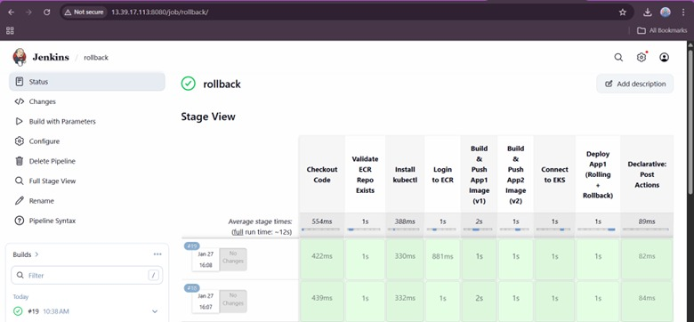
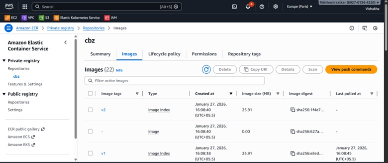
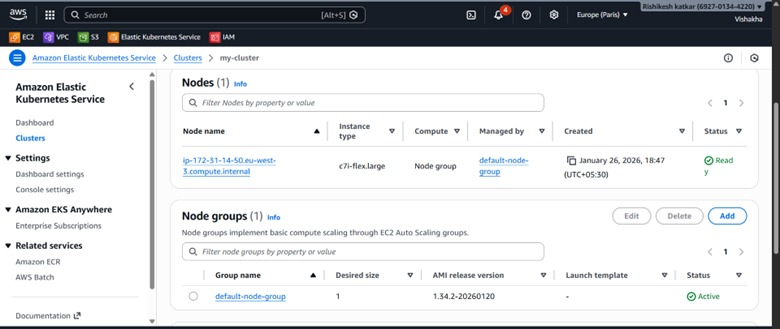
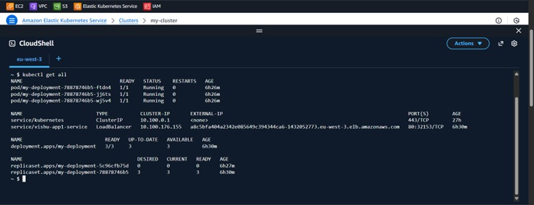
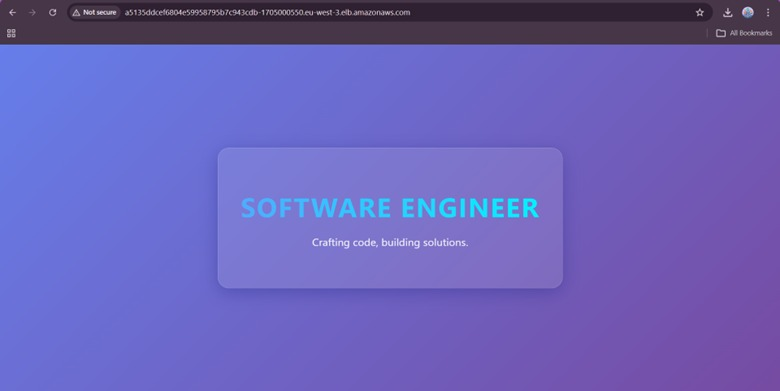
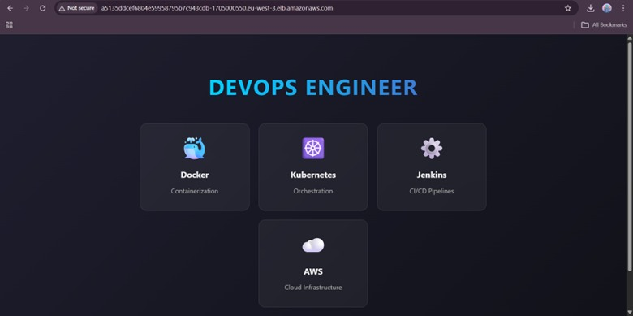

🚀 End-to-End CI/CD Pipeline on AWS EKS
Using Jenkins, Docker, Amazon ECR & Kubernetes

# End-to-End CI/CD Pipeline using Jenkins, Docker, Amazon ECR, and AWS EKS

🎯 Project Objective

Design and implement a production-grade, cloud-native CI/CD pipeline that automatically builds, scans, pushes, and deploys a containerized frontend application to AWS Elastic Kubernetes Service (EKS) using Jenkins.

This pipeline demonstrates real-world DevOps practices such as automation, scalability, zero-downtime deployments, and fast rollbacks — exactly how modern applications are delivered in production.

✨ Key Features & Capabilities

✅ Automated CI/CD triggered by GitHub commits
✅ Dockerized application builds
✅ Secure image storage in Amazon ECR
✅ Kubernetes deployments on AWS EKS
✅ Zero-downtime rolling updates
✅ Instant rollback using Kubernetes
✅ External access via AWS LoadBalancer
✅ Production-ready architecture

🧩 High‑Level Architecture (EKS‑Specific)  
Developer  
│  
▼  
GitHub Repository  
│ ( Poll SCM)  
▼

Create a cluster using jenkinsfile

│  
▼  
Jenkins (EC2 / VM)  
│  
├── Build Docker Image  
├── Push Image to Amazon ECR  
└── Deploy to AWS EKS  
│  
▼  
Kubernetes Cluster (EKS)  
│  
├── Deployment (RollingUpdate)  
└── Service (LoadBalancer)  
│  
▼  
End Users (LoadBalancer )

  
🔁 CI/CD Flow – Step-by-Step Explanation
1️⃣ Code Commit

The developer pushes application code (HTML + Dockerfile) to the GitHub repository.

2️⃣ Jenkins Trigger

Jenkins automatically detects the change using Poll SCM and starts the pipeline.

3️⃣ Build Stage

Jenkins:

Pulls the latest source code

Builds a Docker image using the Dockerfile

4️⃣ EKS Cluster Creation (via Jenkinsfile)

Using AWS CLI and eksctl commands inside the Jenkinsfile, Jenkins:

Creates or validates the EKS cluster

Updates kubeconfig for cluster access

5️⃣ Push Image to Amazon ECR

Jenkins:

Authenticates with AWS ECR

Tags the Docker image

Pushes the image securely to Amazon ECR

6️⃣ Deploy to AWS EKS

Jenkins deploys the application by applying Kubernetes YAML files using kubectl.

7️⃣ Service Exposure

The application is exposed to the internet using a Kubernetes LoadBalancer Service, providing a public URL.

8️⃣ Rolling Update (Zero Downtime)

New pods are created gradually

Old pods remain active until new pods are healthy

LoadBalancer sends traffic only to healthy pods

🔄 Rollout & Rollback Strategy (With LoadBalancer)
✅ Rolling Update

Managed using Kubernetes Deployment strategy

Ensures zero downtime

Seamless traffic switching

⏪ Rollback Strategy

If a deployment fails or issues are detected:

kubectl rollout undo deployment my-deployment

🎉 Benefits

Instant rollback

No image rebuild required

Zero service interruption

📂 Repository Structure
.
├── index.html
├── Dockerfile
├── Jenkinsfile
├── deployment.yaml
├── service-app1.yaml
│
├── app2/
│   ├── deployment-app2.yaml
│   ├── service-app2.yaml
│   ├── Dockerfile
│   └── Jenkinsfile
│
└── screenshots/

🧪 Jenkinsfile

📌 The Jenkinsfile includes:

SCM polling

Docker build & tag

AWS ECR authentication

Image push

EKS deployment using kubectl

🔗 Link to Jenkinsfile:
[Link to jenkinsfile](./jenkinsfile)

☸️ Kubernetes Deployment YAML (Full – Verbatim)

📄 deployment.yaml (App v1)
🔗 Link to first image & YAML
[Link to first image](./deployment.yaml)
[Link to first image](./service-app1.yaml)

📄 deployment-app2.yaml (App v2)
🔗 Link to second image & YAML
 [Link to second image](./app2/deployment-app2.yaml)
  [Link to first image](./app2/service-app2.yaml)

🖼️ Screenshots (Add under /screenshots)

**Jenkins Pipeline Success**

**Amazon ECR Image**

**EKS Nodes & Pods**

**LoadBalancer External IP**

**Application Output in Browser**

**V2 image output in Browser**

**Rollback Output in Browser**

 

🧾 Important AWS & Kubernetes Commands
🔹 Create ECR Repository
aws ecr create-repository \
  --repository-name my-cluster \
  --region eu-west-3

🔹 Update kubeconfig
aws eks update-kubeconfig \
  --region eu-west-3 \
  --name my-cluster

🔹 Verify Pods & Services
kubectl get pods
kubectl get svc

🔹 Rollback Deployment
kubectl rollout undo deployment my-deployment

🏁 Final Outcome

🎉 Project Achievements

✔ Fully automated CI/CD pipeline
✔ Production-ready AWS EKS deployment
✔ Secure Docker image storage in Amazon ECR
✔ Zero-downtime rolling updates
✔ Fast and reliable rollback strategy
✔ Scalable, cloud-native DevOps architecture

